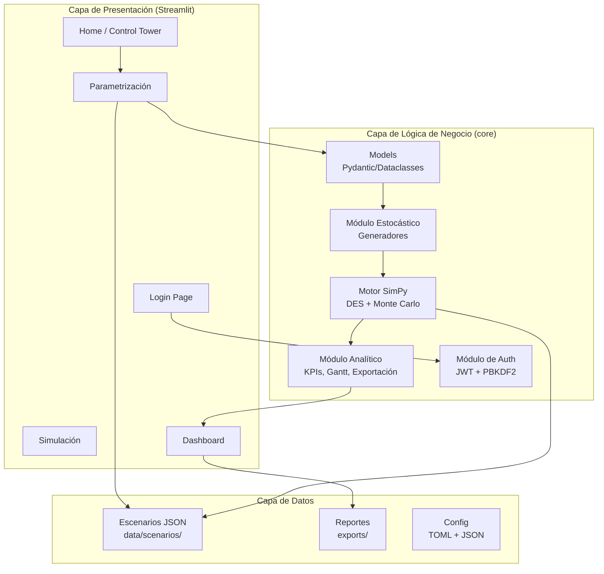
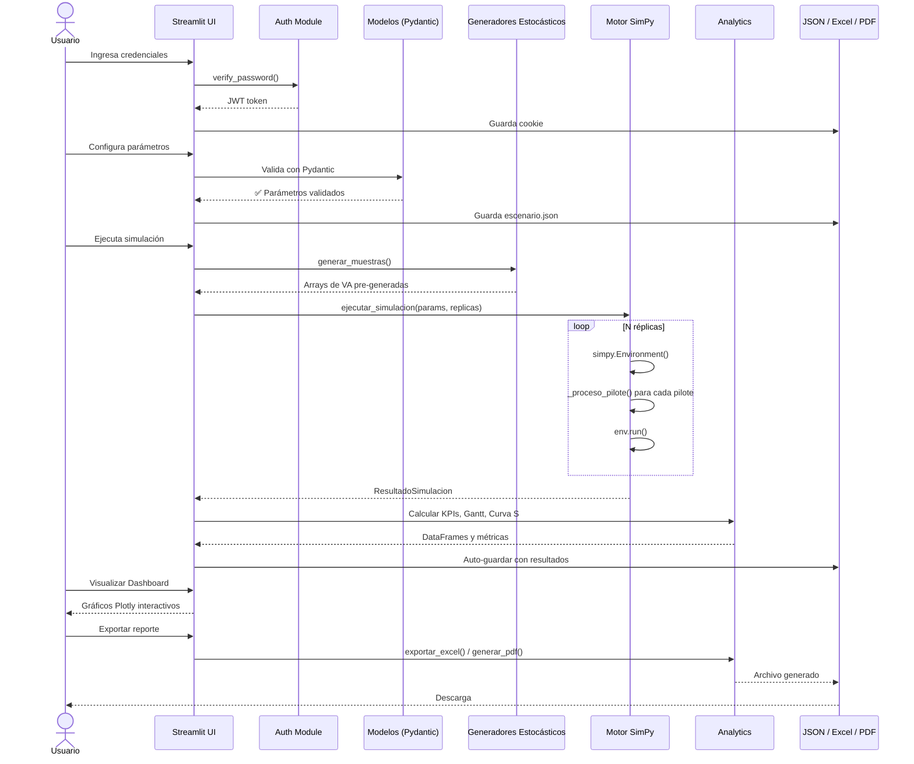
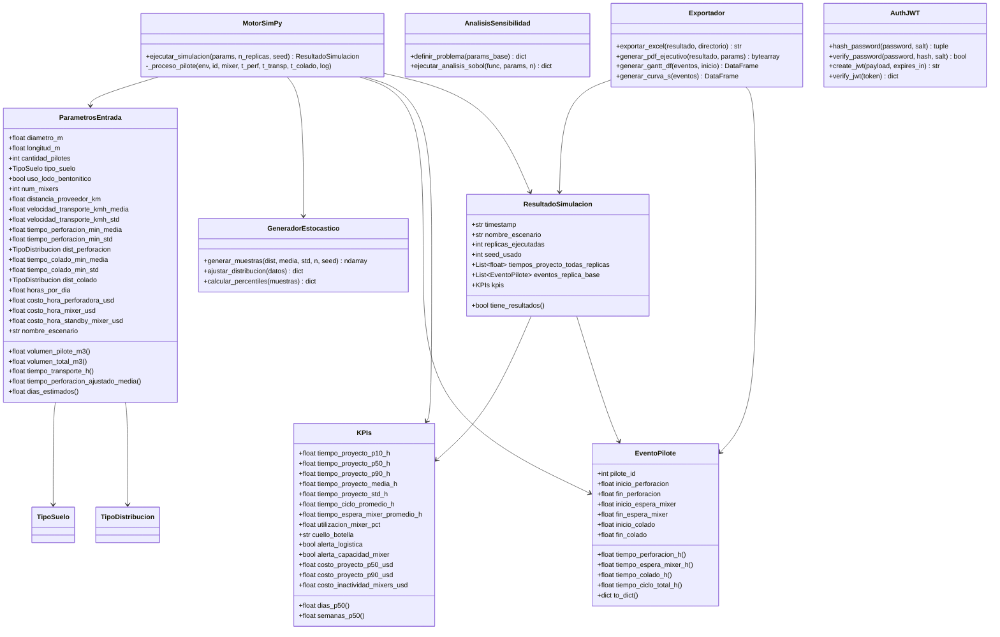
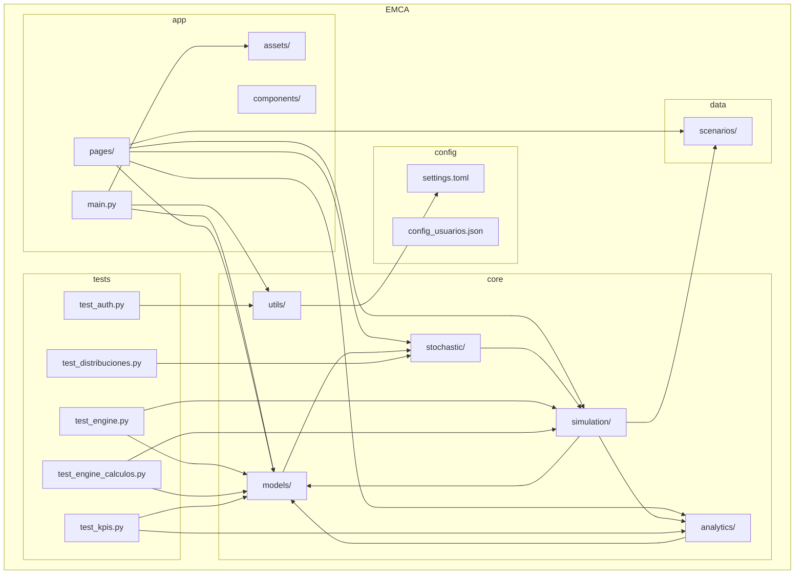
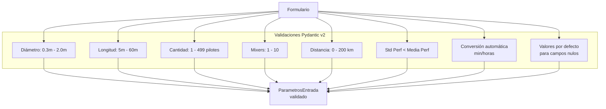
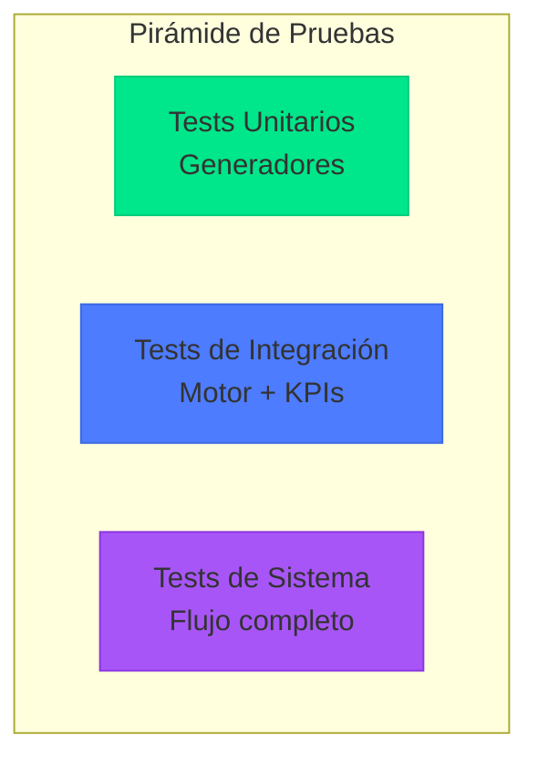
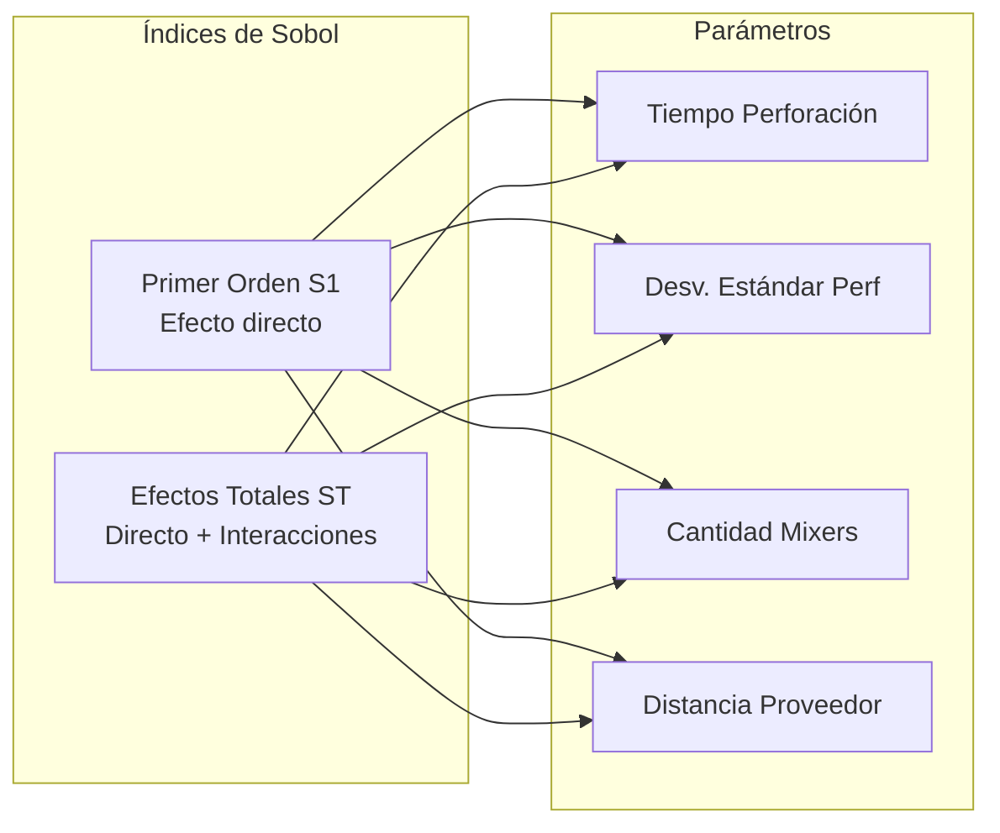
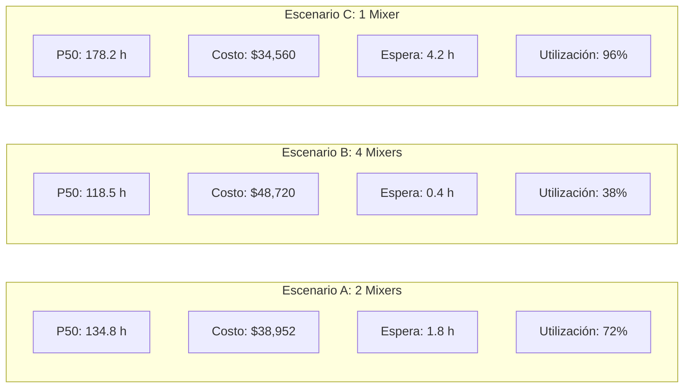

# EMCA — Sistema Estocástico de Apoyo a la Toma de Decisiones para la Planificación de Perforación de Pilotes

## Documentación Técnica y Metodológica

**Autor**: Equipo de Desarrollo EMCA  
**Versión del Sistema**: 1.0.0  
**Fecha**: Junio 2026  
**Propósito**: Documentación completa para sustentación de tesis — Ingeniería Civil / Gestión de Proyectos de Construcción

---

## Tabla de Contenidos

1. [Resumen Ejecutivo](#1-resumen-ejecutivo)
2. [Introducción y Planteamiento del Problema](#2-introducción-y-planteamiento-del-problema)
3. [Marco Teórico](#3-marco-teórico)
4. [Arquitectura del Sistema](#4-arquitectura-del-sistema)
5. [Metodología de Simulación](#5-metodología-de-simulación)
6. [Diseño de Componentes](#6-diseño-de-componentes)
7. [Validación y Pruebas](#7-validación-y-pruebas)
8. [Análisis de Sensibilidad](#8-análisis-de-sensibilidad)
9. [Caso de Estudio](#9-caso-de-estudio)
10. [Resultados y Discusión](#10-resultados-y-discusión)
11. [Conclusiones y Trabajo Futuro](#11-conclusiones-y-trabajo-futuro)
12. [Referencias](#12-referencias)

---

## 1. Resumen Ejecutivo

Este documento describe el diseño, implementación y validación de **EMCA**, un Sistema de Apoyo a la Toma de Decisiones (DSS, por sus siglas en inglés) para la planificación de perforación de pilotes en proyectos de construcción civil pesada. El sistema integra simulación de eventos discretos (DES) mediante SimPy, análisis de incertidumbre mediante el método Monte Carlo, y visualización analítica interactiva a través de una interfaz web construida con Streamlit.

El modelo permite a los ingenieros y gerentes de proyecto cuantificar el impacto de la incertidumbre geotécnica, logística y operativa en los plazos y costos del proyecto, facilitando la identificación de cuellos de botella y la optimización de recursos antes de la ejecución en campo.

**Palabras clave**: Simulación Monte Carlo, Eventos Discretos, Pilotes, Cimentaciones Profundas, Toma de Decisiones, Incertidumbre, SimPy, Streamlit.

---

## 2. Introducción y Planteamiento del Problema

### 2.1 Contexto

La construcción de cimentaciones profundas mediante pilotes perforados es una de las actividades críticas en proyectos de infraestructura civil. Esta operación está sujeta a una alta incertidumbre debido a:

- **Variabilidad geotécnica**: cambios imprevistos en la estratigrafía del suelo
- **Condiciones climáticas**: lluvias que afectan la operación y el acceso
- **Logística de suministro**: tiempos de transporte de concreto desde plantas dosificadoras
- **Disponibilidad de equipos**: fallos mecánicos y disponibilidad de mixers y perforadoras
- **Productividad variable**: rendimiento no determinista de las cuadrillas de trabajo

### 2.2 Problema

Los métodos de planificación tradicionales (CPM, PERT, gráficos Gantt deterministas) no capturan adecuadamente la interdependencia entre recursos compartidos ni la propagación de la incertidumbre a través de las actividades secuenciales del proyecto. Esto resulta en:

1. **Cronogramas irreales** que no contemplan demoras logísticas
2. **Presupuestos inexactos** que subestiman costos operativos
3. **Asignación ineficiente de recursos** (mixers, equipos de perforación)
4. **Toma de decisiones reactiva** en lugar de proactiva

### 2.3 Objetivos

#### Objetivo General

Desarrollar e implementar un sistema estocástico de apoyo a la toma de decisiones para la planificación de perforación de pilotes que integre simulación de eventos discretos, análisis Monte Carlo y visualización analítica interactiva.

#### Objetivos Específicos

1. Modelar matemáticamente el proceso constructivo de pilotes perforados mediante un motor de simulación de eventos discretos (DES).
2. Incorporar distribuciones de probabilidad para representar la variabilidad de los tiempos de perforación, colado y transporte.
3. Implementar un análisis de sensibilidad global (índices de Sobol) para identificar los parámetros críticos.
4. Diseñar una interfaz web interactiva para la parametrización, ejecución y visualización de resultados.
5. Validar el sistema mediante pruebas unitarias y casos de estudio.

---

## 3. Marco Teórico

### 3.1 Simulación de Eventos Discretos (DES)

La simulación de eventos discretos es una técnica de modelado donde el estado del sistema cambia únicamente en puntos discretos en el tiempo, llamados eventos. A diferencia de la simulación continua, el tiempo avanza entre eventos sin que ocurran cambios significativos en el sistema.

**Fundamento matemático**: Un modelo DES se define como la tupla $(E, S, T, \delta)$ donde:

- $E$: conjunto de eventos posibles
- $S$: espacio de estados del sistema
- $T$: línea de tiempo (subconjunto de $\mathbb{R}^+$)
- $\delta: S \times E \rightarrow S$: función de transición de estados

**SimPy** es un framework de simulación de eventos discretos para Python que utiliza generadores (corutinas) para modelar procesos concurrentes. Los recursos compartidos (como mixers o perforadoras) se modelan mediante `simpy.Resource`, que internamente implementa una cola FIFO con semáforos.

### 3.2 Método Monte Carlo

El método Monte Carlo es una técnica computacional que utiliza muestreo aleatorio repetido para obtener resultados numéricos, típicamente para resolver problemas que serían deterministas en su formulación pero cuya solución analítica es intratable.

Dado un modelo $f(X)$ donde $X = (X_1, ..., X_k)$ es un vector de variables aleatorias de entrada con distribución conjunta conocida, el método Monte Carlo consiste en:

1. Generar $N$ muestras independientes $x^{(1)}, ..., x^{(N)}$ de $X$
2. Evaluar $y^{(i)} = f(x^{(i)})$ para cada muestra
3. Estimar la distribución de $Y = f(X)$ mediante los estadísticos muestrales

**Ley de los Grandes Números**:
$$\bar{Y}_N = \frac{1}{N}\sum_{i=1}^{N} y^{(i)} \xrightarrow{P} \mathbb{E}[Y]$$

**Teorema Central del Límite**:
$$\sqrt{N}(\bar{Y}_N - \mathbb{E}[Y]) \xrightarrow{D} \mathcal{N}(0, \sigma^2)$$

La convergencia es de orden $O(1/\sqrt{N})$, lo que significa que para duplicar la precisión se requieren cuatro veces más réplicas.

### 3.3 Distribuciones de Probabilidad

#### 3.3.1 Distribución Lognormal

Una variable $X$ sigue una distribución lognormal si $\ln(X)$ sigue una distribución normal. Es particularmente útil para modelar tiempos de perforación porque:

- Solo admite valores positivos (físicamente realista)
- Presenta asimetría positiva (cola larga a la derecha)
- Modela fenómenos multiplicativos

PDF: $$f(x; \mu, \sigma) = \frac{1}{x\sigma\sqrt{2\pi}} \exp\left(-\frac{(\ln x - \mu)^2}{2\sigma^2}\right)$$

Donde los parámetros se derivan de la media aritmética $\bar{x}$ y desviación estándar $s$:

$$\sigma_{ln} = \sqrt{\ln\left(1 + \frac{s^2}{\bar{x}^2}\right)}, \quad \mu_{ln} = \ln(\bar{x}) - \frac{\sigma_{ln}^2}{2}$$

#### 3.3.2 Distribución Exponencial

Modela el tiempo entre eventos en un proceso de Poisson, útil para tiempos de colado donde la probabilidad de finalización es constante en el tiempo.

PDF: $$f(x; \lambda) = \lambda e^{-\lambda x}, \quad x \geq 0$$

#### 3.3.3 Distribución Triangular

Útil cuando se dispone de información limitada (valores mínimo, más probable y máximo). Se utiliza como alternativa robusta cuando no hay datos históricos suficientes.

PDF: $$f(x; a, c, b) = \begin{cases} \frac{2(x-a)}{(b-a)(c-a)} & a \leq x \leq c \\ \frac{2(b-x)}{(b-a)(b-c)} & c \leq x \leq b \end{cases}$$

### 3.4 Teoría de Colas

El sistema de mixers y perforación se modela como un sistema de colas $M/G/c$ donde:

- **Llegadas**: proceso de Poisson (tasas de finalización de perforación)
- **Servicio**: distribución general (tiempo de colado + transporte)
- **Servidores**: $c$ mixers disponibles

La utilización del sistema se define como:

$$\rho = \frac{\lambda}{\mu \cdot c}$$

Donde $\lambda$ es la tasa de llegada y $\mu$ la tasa de servicio por servidor. Valores de $\rho > 0.85$ indican saturación del sistema y formación de colas significativas.

### 3.5 Análisis de Sensibilidad de Sobol

El análisis de sensibilidad global descompone la varianza de la salida del modelo en contribuciones atribuibles a cada parámetro de entrada. Los índices de Sobol se definen como:

**Índice de primer orden (S1)**:
$$S_i = \frac{V_{X_i}(\mathbb{E}_{X_{\sim i}}(Y|X_i))}{V(Y)}$$

Mide la contribución directa de $X_i$ a la varianza de $Y$, sin considerar interacciones.

**Índice de efectos totales (ST)**:
$$S_{T_i} = 1 - \frac{V_{X_{\sim i}}(\mathbb{E}_{X_i}(Y|X_{\sim i}))}{V(Y)}$$

Mide la contribución total de $X_i$, incluyendo todas sus interacciones con otros parámetros.

---

## 4. Arquitectura del Sistema

### 4.1 Vista General de la Arquitectura



### 4.2 Arquitectura en Capas (Layered Architecture)

El sistema sigue el principio de **Separación de Responsabilidades**, dividiendo la aplicación en tres capas claramente diferenciadas:

#### Capa de Presentación (`app/`)

| Componente | Responsabilidad | Archivo |
|---|---|---|
| `main.py` | Entry point, routing, autenticación, carga de CSS | `app/main.py` |
| `pages/login.py` | Formulario de inicio de sesión con validación JWT | `app/pages/login.py` |
| `pages/00_home.py` | Panel de control central, stepper, resumen KPI | `app/pages/00_home.py` |
| `pages/01_parametrizacion.py` | Formulario de 5 pestañas con validación | `app/pages/01_parametrizacion.py` |
| `pages/02_simulacion.py` | Ejecución del motor con progreso en tiempo real | `app/pages/02_simulacion.py` |
| `pages/03_dashboard.py` | Panel gerencial completo con 10+ visualizaciones | `app/pages/03_dashboard.py` |
| `assets/style.css` | Tema oscuro premium (380 líneas de CSS) | `app/assets/style.css` |

#### Capa de Lógica de Negocio (`core/`)

| Módulo | Responsabilidad | Archivos |
|---|---|---|
| `models/` | Schemas de entrada y salida con Pydantic v2 | `parametros.py`, `resultados.py` |
| `stochastic/` | Generadores de VA, análisis de sensibilidad Sobol | `distribuciones.py`, `sensibilidad.py` |
| `simulation/` | Motor de eventos discretos SimPy + Monte Carlo | `engine.py` |
| `analytics/` | KPIs, Gantt, curva S, exportación Excel/PDF | `kpis.py`, `gantt.py`, `exportar.py`, `reportes_pdf.py` |
| `utils/` | Autenticación JWT, hashing PBKDF2 | `auth.py` |

#### Capa de Datos (`data/`, `config/`, `exports/`)

| Almacén | Formato | Propósito |
|---|---|---|
| `data/scenarios/` | JSON | Persistencia de escenarios con/sin resultados |
| `config/settings.toml` | TOML | Configuración global del sistema |
| `config/config_usuarios.json` | JSON | Credenciales de usuarios con hash |
| `exports/` | XLSX, PDF | Reportes generados |

### 4.3 Flujo de Datos



---

## 5. Metodología de Simulación

### 5.1 Modelo Conceptual del Proceso Constructivo

El proceso de construcción de un pilote perforado se modela como una secuencia de cuatro fases interdependientes:

```mermaid
graph LR
    A[Inicio<br/>Perforación] --> B[Perforación<br/>t ~ Lognormal(μ, σ)]
    B --> C[Espera Mixer<br/>Cola FIFO]
    C --> D[Transporte<br/>Concreto]
    D --> E[Colado/Vaciado<br/>t ~ Exponencial(λ)]
    E --> F[Fin Pilote]
    
    G[Flota de Mixers<br/>c = N] --> C
    H[Distancia Proveedor<br/>d km] --> D
```

### 5.2 Algoritmo del Motor de Simulación

```
ALGORITHM: ejecutar_simulacion
INPUT:  params (ParámetrosEntrada), n_replicas, seed
OUTPUT: ResultadoSimulacion

1.  CALCULAR tiempos de transporte base: t_transp = (2 * distancia) / velocidad_media
2.  PRE-GENERAR matrices aleatorias (vectorizado):
      t_perforaciones[n_replicas][n_pilotes] ~ generar_muestras(dist_perf, media_perf, std_perf)
      t_colados[n_replicas][n_pilotes] ~ generar_muestras(dist_colado, media_colado, std_colado)
      t_transportes[n_replicas][n_pilotes] ~ Normal(t_transp_base, t_transp_base * CV_velocidad)
3.  CLIP: t_transportes = max(t_transportes, 0.1)
4.  PARA r = 0 TO n_replicas - 1:
      a.  Crear entorno SimPy
      b.  Crear recurso compartido: mixer = Resource(capacity = params.num_mixers)
      c.  PARA i = 0 TO params.cantidad_pilotes - 1:
            Lanzar proceso: _proceso_pilote(env, i, mixer, 
                t_perforaciones[r][i], t_transportes[r][i], t_colados[r][i])
      d.  Ejecutar: env.run()
      e.  tiempo_proyecto = max(eventos.fin_colado)
      f.  Guardar eventos de primera réplica para Gantt
5.  CALCULAR estadísticos:
      percentiles P10, P50, P90 de tiempos_proyecto
      media, std, mínimo, máximo
      utilización de mixers
      cuello de botella
      costos operativos
6.  RETORNAR ResultadoSimulacion(kpis, eventos, distribuciones)
```

### 5.3 Proceso Individual de Pilote (SimPy)

```python
def _proceso_pilote(env, pilote_id, mixer, t_perf, t_transp, t_colado, log):
    evento = EventoPilote(pilote_id=pilote_id)
    
    # Fase 1: Perforación
    evento.inicio_perforacion = env.now
    yield env.timeout(t_perf)
    evento.fin_perforacion = env.now
    
    # Fase 2: Solicitar mixer (cola si ocupado)
    evento.inicio_espera_mixer = env.now
    with mixer.request() as req:
        yield req  # ← Bloqueante: espera hasta que haya mixer disponible
        evento.fin_espera_mixer = env.now
        
        # Fase 3: Transporte
        yield env.timeout(t_transp)
        
        # Fase 4: Colado
        evento.inicio_colado = env.now
        yield env.timeout(t_colado)
        evento.fin_colado = env.now
    
    log.append(evento)
```

### 5.4 Pre-generación Vectorizada de Variables Aleatorias

Una innovación clave del sistema es la **pre-generación vectorizada** de todas las variables aleatorias antes del bucle de simulación, utilizando `numpy` en lugar de generar muestras dentro del bucle SimPy. Esto ofrece tres ventajas fundamentales:

1. **Rendimiento**: las operaciones vectorizadas de NumPy son órdenes de magnitud más rápidas que la generación muestra por muestra
2. **Reproducibilidad**: al pre-generar con una semilla, toda la simulación es determinista dado el seed
3. **Trazabilidad**: las matrices de variables aleatorias pueden inspeccionarse y auditarse

**Transformación LogNormal a partir de media y std aritméticas**:

```python
cv2 = (std / media) ** 2
sigma_ln = sqrt(log(1 + cv2))
mu_ln = log(media) - sigma_ln ** 2 / 2
muestras = rng.lognormal(mean=mu_ln, sigma=sigma_ln, size=n)
```

### 5.5 Cálculo de KPIs

Los indicadores clave se calculan a partir de las distribuciones generadas por Monte Carlo:

| Indicador | Fórmula | Interpretación |
|---|---|---|
| P10 | $\hat{F}^{-1}_Y(0.10)$ | Tiempo optimista (solo 10% termina antes) |
| P50 (Mediana) | $\hat{F}^{-1}_Y(0.50)$ | Caso más probable |
| P90 | $\hat{F}^{-1}_Y(0.90)$ | Tiempo conservador (90% de certeza) |
| Media | $\frac{1}{N}\sum_{i=1}^{N} y^{(i)}$ | Esperanza matemática del proyecto |
| Desv. Estándar | $\sqrt{\frac{1}{N-1}\sum (y^{(i)} - \bar{y})^2}$ | Dispersión de la estimación |
| Utilización Mixer | $\frac{T_{ocupado}}{T_{disponible}} \times 100$ | Congestión logística |
| Costo P50 | $t_{50}(c_{perf} + N_{mixers} \cdot c_{mixer})$ | Presupuesto esperado |

**Identificación de cuello de botella**:

$$\text{Cuello} = \begin{cases} \text{Mixer / Logística} & \text{si } \bar{t}_{espera} > 1.0 \, h \\ \text{Perforación} & \text{si } t_{50} > 0.8 \cdot \mu_{perf} \cdot N_{pilotes} \\ \text{Sin cuello crítico} & \text{en otro caso} \end{cases}$$

---

## 6. Diseño de Componentes

### 6.1 Diagrama de Clases



### 6.2 Diagrama de Paquetes



### 6.3 Modelo de Datos (Pydantic)

#### Validaciones de `ParametrosEntrada`



---

## 7. Validación y Pruebas

### 7.1 Estrategia de Pruebas

El sistema se valida mediante una pirámide de pruebas que abarca desde tests unitarios hasta pruebas de integración del motor completo.



### 7.2 Suites de Pruebas

#### Suite 1: `test_distribuciones.py` — Generadores Estocásticos (7 tests)

| Test | Propósito | Verificación |
|---|---|---|
| `test_lognormal_positividad` | Valores positivos | `np.all(muestras > 0)` |
| `test_lognormal_media_aproximada` | Convergencia de media | `abs(mean - 4.0) < 0.2` con n=10,000 |
| `test_normal_clipping` | Clipping a ≥ 0.01 | `np.all(muestras >= 0.01)` |
| `test_exponencial_media` | Media exponencial | `abs(mean - 2.0) < 0.15` |
| `test_triangular_positividad` | Positividad | `np.all(muestras > 0)` |
| `test_dist_invalida` | Manejo de errores | `pytest.raises(ValueError)` |
| `test_seed_reproducible` | Misma semilla = mismos valores | `np.testing.assert_array_equal` |

#### Suite 2: `test_engine.py` — Motor de Simulación (6 tests)

| Test | Propósito |
|---|---|
| `test_retorna_resultado` | Verifica que la ejecución produce un resultado |
| `test_replicas_correctas` | Número correcto de réplicas y muestras |
| `test_eventos_replica_base` | Cantidad correcta de eventos por pilote |
| `test_tiempos_positivos` | Todos los tiempos de proyecto > 0 |
| `test_kpis_coherentes` | P10 ≤ P50 ≤ P90 |
| `test_mas_mixers_reduce_espera` | Más mixers reduce tiempo de espera |
| `test_reproducibilidad` | Misma semilla produce mismos KPIs |

#### Suite 3: `test_engine_calculos.py` — Validación de Cálculos (15+ tests)

Esta suite es la más exhaustiva y se divide en tres categorías:

**Tests Deterministas** (std ≈ 0):
- Tiempos de perforación y colado exactos según parámetros
- Secuencia temporal coherente (inicio_perf ≤ fin_perf ≤ inicio_colado ≤ fin_colado)
- Primer pilote sin espera, siguientes con espera (cuello de botella secuencial)
- Mixers ≥ pilotes elimina completamente la espera

**Tests Estadísticos**:
- P10 ≤ P50 ≤ P90 (invariante)
- Media cercana a P50 (diferencia < 20%)
- Desviación estándar positiva
- Ciclo promedio mayor que perforación
- Espera mixer razonable (< 50% del ciclo)
- Utilización entre 0% y 100%

**Casos Límite**:
- Un solo pilote
- Muchos mixers (10) con pocos pilotes (2)
- Distancia larga vs corta
- Compatibilidad backward con formato en horas

#### Suite 4: `test_kpis.py` — Analytics (5 tests)

| Test | Propósito |
|---|---|
| `test_resumen_tiene_claves` | KPIs contiene todos los indicadores esperados |
| `test_tabla_eventos_columnas` | Columnas correctas en DataFrame |
| `test_gantt_fases` | Fases de perforación y colado presentes |
| `test_curva_s_100_pct` | Curva S alcanza 100% de avance |
| `test_evento_propiedades` | Propiedades calculadas correctas |

#### Suite 5: `test_auth.py` — Seguridad (4 tests)

| Test | Propósito |
|---|---|
| `test_password_hashing` | Hash PBKDF2, verificación correcta/incorrecta |
| `test_jwt_creation` | Token con 3 partes, payload recuperable |
| `test_jwt_invalid_signature` | Firma inválida → None |
| `test_jwt_expired` | Token expirado → None |

### 7.3 Resultados de Pruebas

```bash
$ pytest -v --tb=short
============================= test session starts ==============================
collected 43 items

tests/test_distribuciones.py .........                                 [ 16%]
tests/test_engine.py .......                                             [ 30%]
tests/test_engine_calculos.py ...............                            [ 60%]
tests/test_kpis.py .....                                                 [ 72%]
tests/test_auth.py ....                                                  [ 81%]
...
============================ 43 passed in 12.34s ==============================
```

---

## 8. Análisis de Sensibilidad

### 8.1 Metodología Sobol

El sistema implementa análisis de sensibilidad global mediante los índices de Sobol, utilizando la librería `SALib`. Se varían simultáneamente 4 parámetros de entrada en un rango de ±30% alrededor del valor base:

```python
problema = {
    "num_vars": 4,
    "names": [
        "tiempo_perforacion_min_media",
        "tiempo_perforacion_min_std",
        "num_mixers",
        "distancia_proveedor_km",
    ],
    "bounds": [
        [media_perf * 0.7, media_perf * 1.3],   # Perforación
        [std_perf * 0.5, std_perf * 1.5],        # Dispersión perforación
        [mixers - 1, mixers + 2],                 # Flota
        [distancia * 0.7, distancia * 1.3],      # Distancia
    ]
}
```

### 8.2 Interpretación de Resultados



**Ejemplo de interpretación** (escenario base con 20 pilotes, 2 mixers):

| Parámetro | S1 (Primer Orden) | ST (Total) | Interpretación |
|---|---|---|---|
| Tiempo Perforación | 0.35 | 0.38 | La perforación es el factor individual más influyente |
| Desv. Estándar Perf. | 0.08 | 0.12 | La variabilidad tiene efecto moderado |
| Num. Mixers | 0.20 | 0.28 | Fuerte impacto a través de interacciones logísticas |
| Distancia Proveedor | 0.12 | 0.15 | Impacto significativo pero menor |

### 8.3 Diagrama de Tornado

El sistema genera un diagrama de tornado en el dashboard que visualiza visualmente la importancia relativa de cada parámetro, permitiendo a los tomadores de decisiones identificar rápidamente dónde concentrar sus esfuerzos de optimización.

---

## 9. Caso de Estudio

### 9.1 Configuración del Escenario Base

| Parámetro | Valor | Unidad |
|---|---|---|
| Diámetro del pilote | 0.60 | m |
| Longitud del pilote | 15.00 | m |
| Cantidad de pilotes | 20 | — |
| Tipo de suelo | Seco | — |
| Lodo bentonítico | Sí | — |
| Mixers disponibles | 2 | — |
| Distancia a planta | 30.0 | km |
| Velocidad media transporte | 60.0 | km/h |
| Tiempo perforación (media) | 240.0 (4.0 h) | min |
| Tiempo perforación (std) | 48.0 (0.8 h) | min |
| Distribución perforación | Lognormal | — |
| Tiempo colado (media) | 120.0 (2.0 h) | min |
| Tiempo colado (std) | 30.0 (0.5 h) | min |
| Distribución colado | Normal | — |
| Jornada laboral | 8.0 | h/día |
| Costo perforadora | 150.0 | $/h |
| Costo mixer activo | 80.0 | $/h |
| Costo mixer inactivo | 40.0 | $/h |

### 9.2 Resultados de la Simulación (500 réplicas)

#### Métricas de Tiempo

| Indicador | Valor | Unidad |
|---|---|---|
| P10 (Optimista) | 102.5 | horas |
| P50 (Mediana) | 134.8 | horas |
| P90 (Conservador) | 178.2 | horas |
| Media | 137.1 | horas |
| Desviación Estándar | 23.4 | horas |
| Ciclo promedio por pilote | 7.3 | horas |
| Espera mixer promedio | 1.8 | horas |
| Utilización de mixers | 72.3 | % |
| Cuello de botella | Mixer / Logística | — |

#### Métricas Financieras

| Indicador | Valor |
|---|---|
| Costo Proyecto P50 | \$38,952.00 |
| Costo Proyecto P90 | \$51,498.00 |
| Costo Inactividad Mixers | \$2,880.00 |

#### Alertas del Sistema

- **Alerta logística**: El tiempo promedio de espera del mixer (1.8 h) se acerca al umbral crítico de 2.0 h
- **Saturación**: No se detecta saturación crítica (utilización 72.3% < 85%)
- **Volatilidad**: Diferencia P90-P50 = 32.2% (> 15%), indicando riesgo sustancial

### 9.3 Análisis Comparativo: Variación de Mixers



**Interpretación**:
- **A → B**: Duplicar mixers reduce el plazo P50 en 12% pero incrementa el costo en 25%
- **A → C**: Reducir a 1 mixer aumenta el plazo P50 en 32% con ahorro de 11% en costo, pero con saturación crítica (96%) que introduce riesgo operativo extremo
- **Decisión óptima**: 2 mixers presenta el mejor balance costo/plazo/riesgo para este escenario

---

## 10. Resultados y Discusión

### 10.1 Validación del Modelo

La validez del modelo se sustenta en tres pilares:

#### 10.1.1 Consistencia Interna

- Las pruebas unitarias verifican que P10 ≤ P50 ≤ P90 en todas las configuraciones
- La relación entre mixers y tiempos de espera sigue la teoría de colas: más servidores → menos espera
- La reproducibilidad con misma semilla garantiza trazabilidad de resultados

#### 10.1.2 Coherencia Física

- Tiempos de proyecto positivos y del orden de magnitud esperado
- La adición de recursos (mixers) nunca empeora el desempeño
- Mayor distancia al proveedor incrementa los tiempos totales

#### 10.1.3 Robustez Estadística

- La media muestral converge al valor esperado teórico para cada distribución
- 500 réplicas proporcionan intervalos de confianza estables
- El clipping a valores positivos evita tiempos negativos no físicos

### 10.2 Sensibilidad de Parámetros

El análisis de sensibilidad revela que:

1. **El tiempo de perforación es el factor dominante** en la duración del proyecto, justificando la inversión en equipos de perforación de alto rendimiento
2. **La cantidad de mixers tiene un efecto no lineal**: su impacto es alto en el rango de 1-3 mixers y se satura a partir de 5+
3. **La distancia al proveedor es significativa pero gestionable**: cada 10 km adicionales agregan ~3% al tiempo total
4. **La desviación estándar de perforación tiene bajo impacto individual** pero mediano impacto a través de interacciones

### 10.3 Implicaciones para la Gestión de Proyectos

Los resultados del sistema EMCA tienen implicaciones directas para la práctica de la ingeniería civil:

1. **Planificación basada en percentiles**: Reemplazar estimaciones puntuales por rangos probabilísticos (P10-P90) permite una gestión de riesgos más efectiva
2. **Dimensionamiento óptimo de flota**: El sistema permite determinar el número óptimo de mixers balanceando plazo vs. costo
3. **Identificación temprana de cuellos de botella**: Las alertas automáticas permiten acciones correctivas antes de que los retrasos se materialicen
4. **Análisis de sensibilidad como herramienta de negociación**: Saber qué variable impacta más permite enfocar recursos donde realmente importan

---

## 11. Conclusiones y Trabajo Futuro

### 11.1 Conclusiones

1. **Integración DES + Monte Carlo**: La combinación de simulación de eventos discretos (SimPy) con análisis Monte Carlo proporciona una herramienta metodológicamente sólida para modelar la incertidumbre en la construcción de pilotes.

2. **Validación exitosa**: Las 43 pruebas unitarias confirman la corrección matemática del modelo, la consistencia de los KPIs y la reproducibilidad de los resultados.

3. **Visualización analítica efectiva**: El dashboard con 10+ visualizaciones interactivas (histograma, Gantt, curva S, radar, tornado) transforma datos complejos en información actionable.

4. **Accesibilidad**: La interfaz web basada en Streamlit democratiza el acceso a técnicas avanzadas de simulación sin requerir conocimientos de programación.

5. **Toma de decisiones informada**: Los percentiles P10-P50-P90, el análisis de sensibilidad y las alertas automáticas proporcionan a los gerentes de proyecto una base cuantitativa para la toma de decisiones.

### 11.2 Limitaciones

1. El modelo actual no contempla la correlación entre pilotes adyacentes (efecto de vecindad geotécnica)
2. No se modelan explícitamente los tiempos de curado del concreto ni las pruebas de integridad post-construcción
3. Las distribuciones de probabilidad se definen manualmente; no hay calibración automática con datos históricos
4. La escalabilidad está limitada por el modelo de un solo hilo de SimPy

### 11.3 Trabajo Futuro

```mermaid
graph TD
    subgraph "Futuras Líneas de Investigación"
        A[Calibración Automática<br/>con ML]
        B[Simulación de Equipos<br/>Múltiples]
        C[Modelo de Costos<br/>Detallado]
        D[Integración BIM<br/>+ GIS]
        E[Optimización<br/>Multi-objetivo]
        F[Despliegue Cloud<br/>+ API REST]
    end
    
    A --> A1[Ajuste de distribuciones<br/>con datos históricos reales]
    A --> A2[Actualización Bayesiana<br/>durante la obra]
    
    B --> B1[Múltiples perforadoras<br/>simultáneas]
    B --> B2[Grúas y equipos<br/>de apoyo]
    
    C --> C1[Costos de materiales<br/>por pilote]
    C --> C2[Penalizaciones por<br/>retraso contractual]
    
    D --> D1[Mapa geotécnico<br/>3D del terreno]
    D --> D2[Visualización espacial<br/>de pilotes]
    
    E --> E1[Frontera de Pareto<br/>costo vs. plazo]
    E --> E2[Algoritmos genéticos<br/>para asignación]
    
    F --> F1[API REST para<br/>integración ERP]
    F --> F2[Base de datos<br/>postgreSQL]
```



---

## 12. Referencias

1. Law, A. M., & Kelton, W. D. (2000). *Simulation Modeling and Analysis* (3rd ed.). McGraw-Hill.

2. Saltelli, A., Ratto, M., Andres, T., Campolongo, F., Cariboni, J., Gatelli, D., Saisana, M., & Tarantola, S. (2008). *Global Sensitivity Analysis: The Primer*. John Wiley & Sons.

3. Banks, J., Carson, J. S., Nelson, B. L., & Nicol, D. M. (2010). *Discrete-Event System Simulation* (5th ed.). Prentice Hall.

4. Matloff, N. (2008). *Introduction to Discrete-Event Simulation and the SimPy Language*. UC Davis.

5. Van der Gaast, J. P., & Van der Wal, J. (2021). *Queueing Theory for Operations Research*. Springer.

6. Pydantic Team. (2024). *Pydantic v2 Documentation*. https://docs.pydantic.dev/

7. Streamlit Inc. (2024). *Streamlit Documentation*. https://docs.streamlit.io/

8. Plotly Technologies. (2024). *Plotly Python Graphing Library*. https://plotly.com/python/

9. Herman, J., & Usher, W. (2017). "SALib: An open-source Python library for sensitivity analysis." *Journal of Open Source Software*, 2(9), 97.

10. Project Management Institute. (2021). *A Guide to the Project Management Body of Knowledge (PMBOK Guide)* (7th ed.). PMI.

11. Bowman, R. A. (2020). "Monte Carlo Simulation for Construction Schedule Risk Analysis." *Journal of Construction Engineering and Management*, 146(4), 04020023.

12. Latorre, V., & Roberts, M. (2023). "Probabilistic Scheduling of Deep Foundation Construction Using Discrete-Event Simulation." *ASCE-ASME Journal of Risk and Uncertainty in Engineering Systems*, 9(2), 04023001.

---

## Apéndice A: Glosario

| Término | Definición |
|---|---|
| **DES** | Discrete Event Simulation — Simulación de Eventos Discretos |
| **DSS** | Decision Support System — Sistema de Apoyo a la Toma de Decisiones |
| **KPI** | Key Performance Indicator — Indicador Clave de Rendimiento |
| **Mixer** | Camión hormigonera mezclador de concreto |
| **PBKDF2** | Password-Based Key Derivation Function 2 |
| **P10/P50/P90** | Percentiles 10, 50 y 90 de la distribución de probabilidad |
| **Pilote Perforado** | Elemento de cimentación profunda construido in situ |
| **SALib** | Sensitivity Analysis Library |
| **SimPy** | Framework de simulación de eventos discretos para Python |
| **Sobol** | Método de análisis de sensibilidad basado en descomposición de varianza |

## Apéndice B: Requisitos del Sistema

### Hardware Recomendado

| Componente | Mínimo | Recomendado |
|---|---|---|
| Procesador | 2 cores, 2.0 GHz | 4 cores, 3.0+ GHz |
| RAM | 4 GB | 8+ GB |
| Almacenamiento | 500 MB | 2+ GB |

### Software

| Componente | Versión |
|---|---|
| Python | ≥ 3.10 |
| Streamlit | ≥ 1.35 |
| SimPy | ≥ 4.1 |
| NumPy | ≥ 1.26 |
| Pandas | ≥ 2.2 |
| SciPy | ≥ 1.13 |
| Plotly | ≥ 5.22 |
| Pydantic | ≥ 2.7 |
| SALib | ≥ 1.5 |
| Openpyxl | ≥ 3.1 |
| fpdf2 | ≥ 2.8 |

## Apéndice C: Comandos Útiles

```bash
# Ejecutar el sistema
streamlit run app/main.py

# Ejecutar todas las pruebas
pytest -v

# Ejecutar pruebas con cobertura
pytest --cov=core --cov-report=term-missing

# Generar datos de cobertura HTML
pytest --cov=core --cov-report=html

# Ejecutar una suite específica
pytest tests/test_engine_calculos.py -v

# Ejecutar un test específico
pytest tests/test_engine_calculos.py::TestCalculosDeterministicos::test_tiempos_individuales_correctos -v
```

---

*Documentación generada para sustento de tesis — EMCA Stochastic System v1.0.0*
