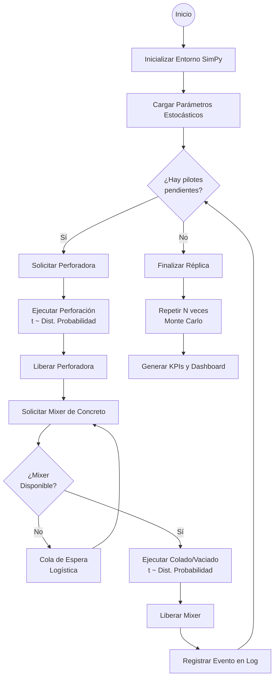

# 🏗️ EMCA — Sistema Estocástico para Planificación de Pilotes

[](https://streamlit.io/)
[](https://www.python.org/downloads/)
[](https://opensource.org/licenses/MIT)

**Sistema de Apoyo a la Toma de Decisiones (DSS)** diseñado para optimizar la logística, la distribución de recursos y la programación de perforación de pilotes en proyectos de construcción civil pesada. Este sistema permite modelar la incertidumbre y variabilidad inherente de las operaciones en campo mediante técnicas avanzadas de simulación.

---

## 📖 Resumen del Proyecto
La construcción de cimentaciones profundas (pilotes) está sujeta a una altísima incertidumbre geotécnica, climática y logística. Factores como la variabilidad del suelo, el tráfico de los camiones mezcladores (mixers) de concreto, tiempos de vaciado y fallos mecánicos imprevistos suelen retrasar las obras e inflar los presupuestos.

Este sistema implementa un **Motor de Simulación de Eventos Discretos (DES)** desarrollado sobre `SimPy`, acoplado a un motor de **Simulación Monte Carlo**. Esto permite a los gerentes de proyecto y a los ingenieros modelar matemáticamente el comportamiento del campo en cientos de réplicas virtuales, identificando cuellos de botella y optimizando el número de mixers antes de mover la primera pala de tierra en el mundo real.

---

## ⚙️ Metodología de Simulación (Lógica SimPy)
Para garantizar la validez científica del modelo (indispensable para validaciones de tesis y auditorías de proyectos), el motor simula el paso de tiempo físico modelando los pilotes y los mixers como entidades interdependientes:



### Componentes Estocásticos y Justificación Científica:
1.  **Distribuciones de Probabilidad Flexibles**: En lugar de promedios fijos irreales, el usuario puede asignar distribuciones de probabilidad (como la **Lognormal** para excavaciones que suelen tener colas largas a la derecha, o **Normal**, **Exponencial** y **Triangular**) tanto para la Perforación como para el Colado (vaciado).
2.  **Contención e Interdependencia de Recursos**: SimPy modela la perforadora y la flota de mixers como recursos limitados. Si la perforación es más rápida que el ciclo del mixer, se produce un retardo de colado, simulando con precisión el tiempo de espera del concreto fresco en obra.
3.  **Análisis de Sensibilidad y Monte Carlo**: Al ejecutar hasta 500 réplicas del proyecto completo, el DSS calcula los percentiles estadísticos clave:
    *   **P10 (Optimista)**: Solo hay un 10% de probabilidad de terminar antes de este tiempo.
    *   **P50 (Caso Más Probable)**: Mediana estadística del proyecto.
    *   **P90 (Conservador/Seguro)**: Existe un 90% de seguridad de culminar la obra dentro de este plazo.

---

## 🧭 Recorrido por los Módulos de la Aplicación

El sistema está estructurado en un flujo de **4 Módulos Interactivos** coordinados mediante un Stepper dinámico y un sidebar elegante:

### 🏠 Inicio — Control Tower
*   Una cordial bienvenida con un resumen ejecutivo de las fases del sistema.
*   **Stepper Inteligente**: Muestra visualmente tu progreso (Parametrización ➔ Simulación ➔ Dashboard) según la presencia de datos activos en la sesión.

### ⚙️ Módulo 1 — Parametrización Estocástica
Permite configurar el escenario de simulación en cuatro pestañas dedicadas:
1.  **📐 Dimensiones**: Diámetro del pilote, longitud (profundidad) y la cantidad de pilotes a construir.
2.  **⛰️ Geología y Entorno**: Tipo de suelo (seco, con presencia de agua, arcillas, rocas) que aplica automáticamente factores multiplicadores de dificultad física a los tiempos de perforación, además de la opción de lodo bentonítico.
3.  **🚚 Logística**: Número de camiones mixers asignados, distancia del proveedor de concreto, velocidad media y desviación estándar del transporte.
4.  **⏱️ Variables Estocásticas**:
    *   **Perforación**: Permite definir la media ($\mu$), desviación estándar ($\sigma$) y su distribución de probabilidad.
    *   **Colado**: Permite configurar de forma independiente la media, la **desviación estándar ($\sigma$ Colado)** y su correspondiente tipo de distribución.
5.  **💾 Guardar Escenario**: Guarda todas las variables en un archivo físico `.json` dentro del servidor para su posterior análisis.

### 🚀 Módulo 2 — Simulación Monte Carlo
*   **Ajuste del tamaño de muestra**: Permite elegir la cantidad de réplicas independientes (10 a 500).
*   **Barra de Progreso y Logs en Tiempo Real**: Muestra el progreso de la simulación mediante una barra interactiva y una consola que reporta eventos críticos a nivel operativo.
*   **Validaciones Físicas Pydantic**: El motor valida la congruencia matemática (por ejemplo, previniendo desviaciones estándar mayores que la media) antes de inicializar el cálculo de SimPy.

### 📊 Módulo 3 — Dashboard Gerencial & Recomendaciones
Aquí se despliega toda la analítica avanzada del proyecto:

1.  **💡 Sugerencias de Optimización (IA Analítica)**:
    Un motor experto que evalúa automáticamente tus resultados y redacta recomendaciones específicas de acción:
    *   *Saturación Logística*: Si la utilización de mixers es superior al 85%, te sugiere incorporar mixers para no estrangular el ritmo de la perforadora.
    *   *Oportunidad de Ahorro*: Si la utilización de mixers es inferior al 45%, te sugiere reducir la flota de camiones contratados para ahorrar costos.
    *   *Sincronización*: Alertas de tiempos muertos excesivos de los mixers en obra.
    *   *Identificación de Restricciones*: Señala si el cuello de botella físico reside en el transporte o en la capacidad de la perforadora.
    *   *Volatilidad*: Te avisa si hay una brecha mayor al 15% entre el escenario esperado (P50) y el pesimista (P90).
2.  **📊 Distribución de Probabilidad Monte Carlo**: Histograma interactivo con las duraciones del proyecto, líneas guía para los percentiles P10, P50 y P90, y un área sombreada del intervalo de confianza.
3.  **📅 Cronograma Gantt de la Réplica Base**: Línea de tiempo interactiva donde puedes seleccionar la fecha real de inicio y ver fase por fase la construcción de cada pilote.
4.  **📈 Curva S (Avance Acumulado)**: Curva interactiva de avance del proyecto que muestra los tramos de alta productividad vs. las mesetas de inactividad.
5.  **🎯 Radar de Eficiencia**: Perfil de cinco ejes (Perforación, Colado, Logística, Mixer, Predictibilidad) que mide la armonía del balance de tu sistema.
6.  **🌪️ Diagrama de Tornado (Sensibilidad)**: Identifica cuál de los parámetros de entrada tiene mayor poder de influencia sobre el tiempo total del proyecto.
7.  **🗂️ Detalle por Pilote**: Tabla interactiva con gradientes térmicos en la columna de esperas (de verde a rojo) y filtros por tiempos de espera o ciclo total.
8.  **⚖️ Comparador de Escenarios**: Compara simultáneamente los parámetros de entrada de dos escenarios distintos grabados en el disco.
9.  **📥 Exportador de Reportes Excel Profesional**: Botón para descargar de forma inmediata la base de datos a Excel.

---

## 📈 Reportes en Excel de Alta Legibilidad (Novedad)
El sistema genera archivos de cálculo Excel (`.xlsx`) optimizados con un diseño corporativo en color azul EMCA, bordes limpios y fuentes Inter, estructurados en tres hojas de cálculo:
1.  **📊 KPIs Gerenciales**: Resumen ejecutivo del escenario.
2.  **📋 Detalle Pilotes**: Bitácora completa de la réplica base pilote por pilote.
3.  **📈 Distribución Tiempos**: Los datos brutos ordenados de todas las corridas Monte Carlo.

### ⏱️ Formato de Tiempos Amigable e Intuitivo
Para evitar confusiones a los tomadores de decisiones que no están acostumbrados a leer tiempos en formato puramente decimal (como `4.80` horas), el exportador de Excel incorpora el formateador inteligente `_formatear_tiempo` que convierte los números en textos explícitos de **horas y minutos**:
*   *Métricas de más de una hora:* `4.80 h` se exporta como **`4.80 h (4h 48min)`**.
*   *Métricas de menos de una hora:* `0.75 h` se exporta automáticamente como **`0.75 h (45 min)`** para una lectura rápida.
*   *Tiempos de espera nulos:* Un valor de `0.00` se exporta limpiamente como **`0 min`**.

---

## 🛠️ Stack Tecnológico
*   **Frontend y Orquestación**: `Streamlit` (Premium Dark Theme)
*   **Motor de Simulación**: `SimPy` (Entorno de eventos discretos con recursos compartidos)
*   **Lógica Matemática e Incertidumbre**: `NumPy`, `Pandas`, `SciPy` (Generación de variables estocásticas)
*   **Visualizaciones Dinámicas**: `Plotly Express` & `Plotly Graph Objects`
*   **Integridad y Validaciones**: `Pydantic v2`
*   **Generador de Reportes**: `Openpyxl`

---

## 🚀 Guía de Despliegue en Streamlit Community Cloud

Para compartir el sistema en la web de forma gratuita y que tus asesores o clientes puedan utilizarlo online:

1.  **Subir el código a GitHub**:
    *   Crea un repositorio público en tu cuenta de GitHub (ejemplo: `emca-stochastic-system`).
    *   Inicializa git en la carpeta del proyecto, añade los archivos y haz push a tu rama `main` (recuerda que el archivo `.gitignore` ya está preconfigurado para evitar subir entornos virtuales u archivos basura de desarrollo).
2.  **Conectar con Streamlit Cloud**:
    *   Inicia sesión en [share.streamlit.io](https://share.streamlit.io/).
    *   Haz clic en el botón **"New app"**.
    *   Selecciona tu repositorio recién creado, la rama `main` y define la ruta del archivo de entrada principal como: **`app/main.py`**.
3.  **Despliegue automático**:
    *   Streamlit detectará el archivo `requirements.txt` en la raíz del proyecto e instalará automáticamente el stack tecnológico.
    *   ¡En pocos minutos dispondrás de un enlace web seguro (HTTPS) para presentar tu sistema online!

---

## 💻 Instalación Local (Desarrollo)

Si deseas probar y extender la funcionalidad del sistema en tu máquina local:

```bash
# 1. Clonar el repositorio
git clone https://github.com/tu-usuario/emca-stochastic-system.git
cd emca-stochastic-system

# 2. Configurar el entorno virtual de Python
python -m venv .venv

# 3. Activar el entorno
# En Windows (Powershell):
.venv\Scripts\Activate.ps1
# En macOS/Linux:
source .venv/bin/activate

# 4. Instalar las dependencias del sistema
pip install -r requirements.txt

# 5. Lanzar el servidor de desarrollo local
streamlit run app/main.py
```

El navegador se abrirá automáticamente en la dirección local: `http://localhost:8501`.

---
*Desarrollado con altos estándares de excelencia analítica e industrial para la gestión de proyectos de infraestructura civil — EMCA.*
