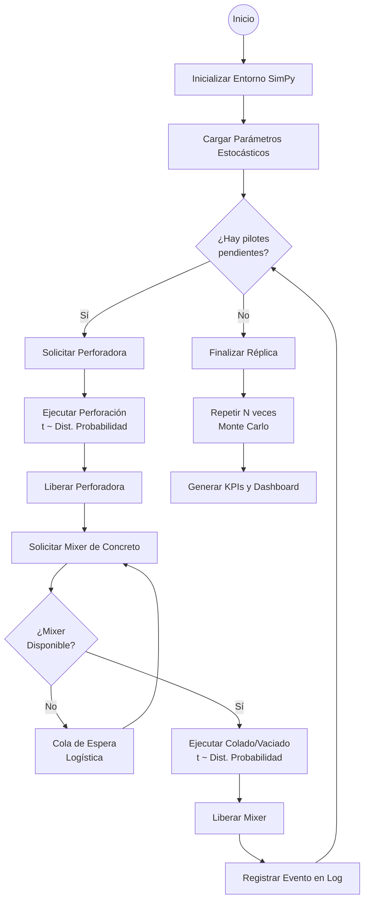

# 🏗️ EMCA — Sistema Estocástico para Planificación de Pilotes

[](https://streamlit.io/)
[](https://www.python.org/downloads/)
[](https://opensource.org/licenses/MIT)

**Sistema de Apoyo a la Toma de Decisiones (DSS)** diseñado para optimizar la logística y programación de perforación de pilotes en proyectos de construcción civil. Este sistema permite modelar la incertidumbre inherente a la construcción mediante técnicas avanzadas de simulación.

## 📖 Resumen del Proyecto
La construcción de fundaciones profundas (pilotes) está sujeta a alta incertidumbre ambiental y logística (tiempos de perforación, tráfico de mixers de concreto, fallos mecánicos). 

Este sistema implementa un **Motor de Simulación de Eventos Discretos (DES)** junto con técnicas de simulación **Monte Carlo** para modelar el comportamiento estocástico de las operaciones en campo, permitiendo a gerentes e ingenieros anticipar cuellos de botella y optimizar la utilización de recursos antes del inicio de la obra.

---

## ⚙️ Metodología de Simulación (Lógica SimPy)
Para garantizar la validez científica del modelo (crucial para tesis de ingeniería), el sistema sigue un flujo lógico de eventos discretos. A continuación se detalla el mapa de procesos que ejecuta el motor de SimPy:



### Justificación de Componentes Estocásticos
1.  **Distribuciones de Probabilidad**: El sistema no utiliza tiempos fijos. Utiliza distribuciones **Lognormal** (para tiempos de construcción) y **Normal** (para logística), capturando la varianza real de la obra.
2.  **Contención de Recursos**: SimPy modela la interacción entre la perforadora y la flota de mixers. Si la perforación es más rápida que el ciclo del mixer, el sistema detecta automáticamente un "Cuello de Botella".
3.  **Análisis Monte Carlo**: Al ejecutar cientos de réplicas, generamos una distribución de resultados (P10, P50, P90), permitiendo una gestión de riesgos basada en probabilidades y no en deseos.

---

## ✨ Características Técnicas
- **Arquitectura de 3 Capas**: Separación estricta entre Lógica de Negocio (Core), UI (App) y Persistencia (Data).
- **Control Tower UI**: Interfaz Premium con diseño "SaaS Industrial" basada en **Glassmorphism**, optimizada para la visualización de KPIs críticos.
- **Analítica Avanzada**: Histogramas con **Boxplots marginales** para análisis de cuartiles y cronogramas Gantt dinámicos.

## 🛠️ Stack Tecnológico
| Capa | Tecnología |
|---|---|
| **Frontend** | `Streamlit` |
| **Motor Simulación** | `SimPy` |
| **Ciencia de Datos** | `NumPy`, `Pandas`, `SciPy` |
| **Visualización** | `Plotly` |
| **Validación** | `Pydantic v2` |

---

## 🚀 Guía de Despliegue en Streamlit Community Cloud

Para que cualquier persona (incluyendo tus tutores de tesis) pueda ver el sistema online, sigue estos pasos:

1.  **Subir a GitHub**:
    *   Crea un repositorio nuevo en tu cuenta de GitHub (ej. `emca-stochastic-system`).
    *   Sube todos los archivos de esta carpeta (asegúrate de incluir el archivo `.gitignore` para no subir la carpeta `.venv`).
2.  **Conectar con Streamlit Cloud**:
    *   Ve a [share.streamlit.io](https://share.streamlit.io/).
    *   Conecta tu cuenta de GitHub.
    *   Haz clic en **"New app"**.
    *   Selecciona tu repositorio, la rama `main` y el archivo principal: `app/main.py`.
3.  **Configuración**:
    *   Streamlit detectará automáticamente el archivo `requirements.txt` e instalará todas las librerías necesarias.
    *   En pocos minutos, tendrás una URL pública para compartir tu sistema.

---

## ⚙️ Instalación Local (Desarrollo)

```bash
# 1. Crear entorno virtual
python -m venv .venv
source .venv/bin/activate # o .venv\Scripts\activate en Windows

# 2. Instalar dependencias
pip install -r requirements.txt

# 3. Ejecutar
streamlit run app/main.py
```

---
*Desarrollado para la optimización de procesos estocásticos en la industria de la construcción civil — EMCA.*
