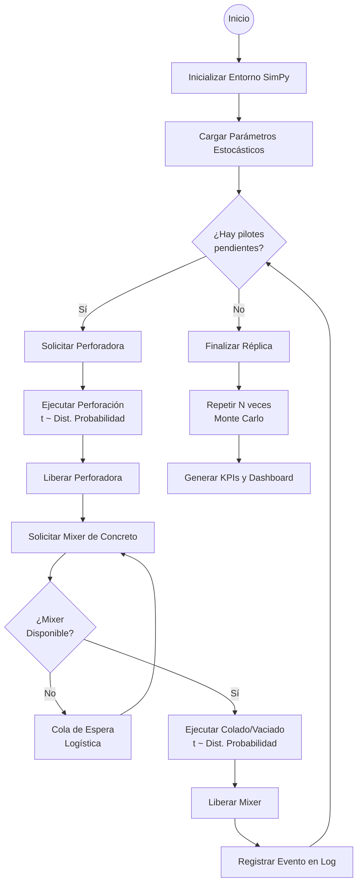

# 🏗️ EMCA — Sistema Estocástico para Planificación de Pilotes

[](https://streamlit.io/)
[](https://www.python.org/downloads/)
[](https://opensource.org/licenses/MIT)

**Sistema de Apoyo a la Toma de Decisiones (DSS)** diseñado para optimizar la logística y programación de perforación de pilotes en proyectos de construcción civil. Este sistema permite modelar la incertidumbre inherente a la construcción mediante técnicas avanzadas de simulación.

## 📖 Resumen del Proyecto
La construcción de fundaciones profundas (pilotes) está sujeta a alta incertidumbre ambiental y logística (tiempos de perforación, tráfico de mixers de concreto, fallos mecánicos). 

Este sistema implementa un **Motor de Simulación de Eventos Discretos (DES)** junto con técnicas de simulación **Monte Carlo** para modelar el comportamiento estocástico de las operaciones en campo, permitiendo a gerentes e ingenieros anticipar cuellos de botella y optimizar la utilización de recursos antes del inicio de la obra.

---

## ⚙️ Metodología de Simulación (Lógica SimPy)
Para garantizar la validez científica del modelo (crucial para tesis de ingeniería), el sistema sigue un flujo lógico de eventos discretos. A continuación se detalla el mapa de procesos que ejecuta el motor de SimPy:



### Justificación de Componentes Estocásticos
1.  **Distribuciones de Probabilidad**: El sistema no utiliza tiempos fijos. Utiliza distribuciones **Lognormal** (para tiempos de construcción) y **Normal** (para logística), capturando la varianza real de la obra.
2.  **Contención de Recursos**: SimPy modela la interacción entre la perforadora y la flota de mixers. Si la perforación es más rápida que el ciclo del mixer, el sistema detecta automáticamente un "Cuello de Botella".
3.  **Análisis Monte Carlo**: Al ejecutar cientos de réplicas, generamos una distribución de resultados (P10, P50, P90), permitiendo una gestión de riesgos basada en probabilidades y no en deseos.

---

## ✨ Características Técnicas
- **Arquitectura de 3 Capas**: Separación estricta entre Lógica de Negocio (Core), UI (App) y Persistencia (Data).
- **Control Tower UI**: Interfaz Premium con diseño "SaaS Industrial" basada en **Glassmorphism**, optimizada para la visualización de KPIs críticos.
- **Analítica Avanzada**: Histogramas con **Boxplots marginales** para análisis de cuartiles y cronogramas Gantt dinámicos.

## 📊 Guía de Gráficos del Dashboard

El **Módulo 3 — Dashboard Gerencial** presenta los resultados de la simulación mediante visualizaciones interactivas. A continuación se explica cada gráfico y cómo interpretarlo:

### 1. 📌 Indicadores Clave (KPI Cards)
| Métrica | Descripción | Cómo interpretarla |
|---|---|---|
| **Duración P10** | Percentil 10 de la distribución de duración | Escenario optimista: solo 10% de probabilidad de terminar antes |
| **Duración P50** | Mediana (percentil 50) | Estimación central — el caso más probable |
| **Duración P90** | Percentil 90 | Escenario conservador: 90% de confianza de terminar antes |
| **Utilización Mixer** | % de tiempo que los mixers están ocupados | >85% indica saturación del sistema de suministro |
| **Cuello de botella** | Fase crítica que limita la velocidad | Identifica dónde enfocar mejoras |

### 2. 📊 Histograma con Boxplot Marginal (Distribución Monte Carlo)
**Qué muestra:** La distribución de duraciones totales del proyecto obtenida tras N réplicas Monte Carlo.

**Cómo leerlo:**
- **Barras del histograma:** Frecuencia de cada rango de duración
- **Boxplot superior:** Muestra mediana (línea central), cuartiles Q1-Q3 (caja), y valores atípicos (puntos)
- **Líneas verticales de color:**
  - 🟢 **P10** (verde): Límite optimista
  - 🟡 **P50** (amarillo): Mediana
  - 🔴 **P90** (rojo): Límite conservador
- **Ancho de la distribución:** Indica la incertidumbre. Una distribución ancha significa alta variabilidad en los resultados.

### 3. 📅 Cronograma Gantt (Réplica Base)
**Qué muestra:** El cronograma detallado de cada pilote en la primera réplica de la simulación.

**Cómo leerlo:**
- **Eje Y:** Número de pilote (P1, P2, P3...)
- **Eje X:** Tiempo en horas desde el inicio
- **Colores por fase:**
  - 🔵 **Perforación:** Tiempo de excavación del pilote
  - 🔴 **Espera Mixer:** Tiempo muerto esperando disponibilidad de concreto
  -  **Colado:** Tiempo de vaciado de concreto
- **Interpretación clave:** Si las barras rojas (espera) son largas, hay un cuello de botella logístico. Si las barras azules dominan, la perforación es la fase limitante.

### 4. 📈 Curva S — Avance Acumulado
**Qué muestra:** El progreso acumulado del proyecto a lo largo del tiempo.

**Cómo leerlo:**
- **Eje X:** Tiempo transcurrido (horas)
- **Eje Y:** Porcentaje de pilotes completados (0-100%)
- **Forma de la curva:**
  - **Pendiente pronunciada:** Avance rápido (buena eficiencia)
  - **Mesetas (tramos planos):** Periodos de estancamiento (cuellos de botella)
  - **Punto de inflexión:** Momento donde la velocidad de avance cambia
- **Uso práctico:** Permite estimar en qué momento del proyecto se completará un porcentaje dado de pilotes.

### 5. 🎯 Radar de Eficiencia del Sistema
**Qué muestra:** Un perfil multidimensional de la eficiencia del sistema en 5 dimensiones.

**Ejes del radar:**
| Eje | Qué mide | Valor ideal |
|---|---|---|
| **Eficiencia Perforación** | % del tiempo total dedicado a perforar | Alto (>40%) |
| **Eficiencia Colado** | % del tiempo total dedicado a colar | Alto (>20%) |
| **Eficiencia Logística** | % del tiempo sin esperas de mixer | Alto (>80%) |
| **Utilización Mixer** | % de uso de la flota de mixers | 70-85% (ni muy bajo ni saturado) |
| **Predictibilidad** | Inversa de la varianza (baja varianza = alta predictibilidad) | Alto (>70%) |

**Cómo leerlo:** Un polígono más grande y regular indica un sistema más eficiente y balanceado. Un polígono irregular señala desbalances (ej: alta perforación pero baja logística).

### 6. 🌪️ Diagrama de Tornado (Análisis de Sensibilidad)
**Qué muestra:** Qué parámetros de entrada tienen mayor impacto en la duración del proyecto.

**Cómo leerlo:**
- **Barras horizontales:** Cada parámetro con su índice de sensibilidad (0 a 1)
- **Barras más largas:** Mayor influencia en el resultado
- **Colores:** Rojo = alta sensibilidad, Verde = baja sensibilidad
- **Uso práctico:** Identifica en qué parámetros enfocar esfuerzos de optimización. Reducir la variabilidad del parámetro más sensible tendrá el mayor impacto en reducir la incertidumbre del proyecto.

### 7. 🗂️ Tabla de Detalle por Pilote
**Qué muestra:** Datos individuales de cada pilote con filtros interactivos.

**Funcionalidades:**
- **Filtro por espera mixer:** Aísla pilotes con problemas logísticos
- **Filtro por ciclo total:** Identifica pilotes atípicos
- **Ordenamiento:** Por cualquier columna (perforación, espera, colado, ciclo total)
- **Heatmap:** Las celdas de "Espera Mixer" se colorean (rojo = alta espera, verde = baja)

### 8. ️ Comparador de Escenarios
**Qué muestra:** Comparación side-by-side de dos escenarios guardados.

**Cómo usarlo:**
1. Selecciona dos escenarios diferentes en los dropdowns
2. Compara parámetros clave: pilotes, mixers, distancia, tiempos
3. Útil para evaluar el impacto de cambios (ej: ¿qué pasa si agrego un mixer?)

---

## 🛠️ Stack Tecnológico
| Capa | Tecnología |
|---|---|
| **Frontend** | `Streamlit` |
| **Motor Simulación** | `SimPy` |
| **Ciencia de Datos** | `NumPy`, `Pandas`, `SciPy` |
| **Visualización** | `Plotly` |
| **Validación** | `Pydantic v2` |

---

## 🚀 Guía de Despliegue en Streamlit Community Cloud

Para que cualquier persona (incluyendo tus tutores de tesis) pueda ver el sistema online, sigue estos pasos:

1.  **Subir a GitHub**:
    *   Crea un repositorio nuevo en tu cuenta de GitHub (ej. `emca-stochastic-system`).
    *   Sube todos los archivos de esta carpeta (asegúrate de incluir el archivo `.gitignore` para no subir la carpeta `.venv`).
2.  **Conectar con Streamlit Cloud**:
    *   Ve a [share.streamlit.io](https://share.streamlit.io/).
    *   Conecta tu cuenta de GitHub.
    *   Haz clic en **"New app"**.
    *   Selecciona tu repositorio, la rama `main` y el archivo principal: `app/main.py`.
3.  **Configuración**:
    *   Streamlit detectará automáticamente el archivo `requirements.txt` e instalará todas las librerías necesarias.
    *   En pocos minutos, tendrás una URL pública para compartir tu sistema.

---

## ⚙️ Instalación Local (Desarrollo)

```bash
# 1. Crear entorno virtual
python -m venv .venv
source .venv/bin/activate # o .venv\Scripts\activate en Windows

# 2. Instalar dependencias
pip install -r requirements.txt

# 3. Ejecutar
streamlit run app/main.py
```

---
*Desarrollado para la optimización de procesos estocásticos en la industria de la construcción civil — EMCA.*
