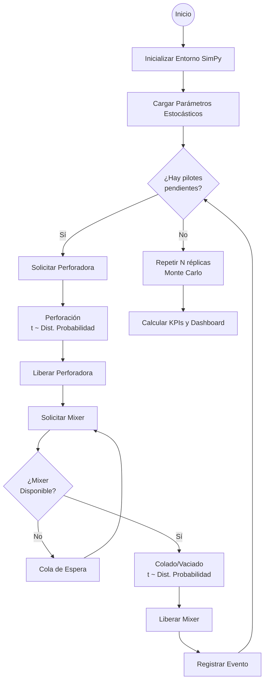

# EMCA — Sistema Estocástico para Planificación de Pilotes

[](https://streamlit.io/)
[](https://www.python.org/downloads/)
[](https://opensource.org/licenses/MIT)
[](https://github.com/psf/black)

**Sistema de Apoyo a la Toma de Decisiones (DSS)** para optimizar la logística, distribución de recursos y programación de perforación de pilotes en proyectos de construcción civil pesada. Modela la incertidumbre y variabilidad operativa mediante simulación de eventos discretos (DES) y análisis Monte Carlo.

---

## 📖 Resumen del Proyecto

La construcción de cimentaciones profundas (pilotes) enfrenta alta incertidumbre geotécnica, climática y logística. La variabilidad del suelo, los tiempos de transporte de concreto, fallos mecánicos y demoras logísticas suelen retrasar obras e inflar presupuestos.

EMCA implementa un **motor de simulación de eventos discretos (SimPy)** acoplado a un **motor Monte Carlo**, permitiendo a ingenieros y gerentes modelar cientos de escenarios virtuales para identificar cuellos de botella y optimizar recursos antes de la ejecución en campo.

---

## ⚙️ Metodología de Simulación

### Flujo del Motor de Eventos Discretos


```mermaid
graph TD
    Start((Inicio)) --> InitEnv[Inicializar Entorno SimPy]
    InitEnv --> LoadParams[Cargar Parámetros Estocásticos]
    LoadParams --> Loop{¿Hay pilotes<br/>pendientes?}
    
    Loop -- Sí --> ReqDrill[Solicitar Perforadora]
    ReqDrill --> ExecDrill[Perforación<br/>t ~ Dist. Probabilidad]
    ExecDrill --> RelDrill[Liberar Perforadora]
    
    RelDrill --> ReqMixer[Solicitar Mixer]
    ReqMixer --> Wait{¿Mixer<br/>Disponible?}
    Wait -- No --> Queue[Cola de Espera]
    Queue --> ReqMixer
    
    Wait -- Sí --> ExecCast[Colado/Vaciado<br/>t ~ Dist. Probabilidad]
    ExecCast --> RelMixer[Liberar Mixer]
    RelMixer --> Log[Registrar Evento]
    Log --> Loop
    
    Loop -- No --> MC[Repetir N réplicas<br/>Monte Carlo]
    MC --> KPIs[Calcular KPIs y Dashboard]
```

### Componentes Estocásticos

| Componente | Distribuciones Soportadas | Justificación |
|---|---|---|
| **Perforación** | Lognormal, Normal, Exponencial, Triangular | La Lognormal modela colas largas a la derecha típicas de excavaciones con imprevistos |
| **Colado** | Lognormal, Normal, Exponencial, Triangular | La Exponencial refleja la naturaleza asimétrica del vaciado de concreto |
| **Transporte** | Normal (con media y desviación) | Variabilidad en velocidad por tráfico y condiciones de ruta |

### Salidas del Modelo

La simulación ejecuta 100–2000 réplicas independientes y calcula:

- **P10 (Optimista)**: solo 10% de probabilidad de terminar antes
- **P50 (Caso más probable)**: mediana estadística del proyecto
- **P90 (Conservador)**: 90% de certeza de culminar dentro del plazo
- **Costo P50 / P90**: proyección financiera
- **Cuello de botella**: identifica restricción principal (mixer, perforación, transporte)
- **Utilización de flota**: porcentaje de ocupación de mixers

---

## 🧭 Módulos de la Aplicación

El sistema está estructurado en 4 páginas con autenticación JWT y navegación lateral:

### 🔐 Login Corporativo
- Autenticación con hash PBKDF2-SHA256 y JWT almacenado en cookies
- Sesión persistente por 24 horas
- Roles: admin, operador

### 🏠 Control Tower (Inicio)
- Stepper visual de progreso (Parametrización → Simulación → Dashboard)
- Tarjetas KPI resumen si hay resultados activos
- Diagrama de flujo del proceso
- Lista de escenarios guardados con metadatos

### 📋 Parametrización Estocástica
5 pestañas de configuración:

1. **📐 Geometría**: diámetro, longitud, cantidad de pilotes — con cálculo de volumen
2. **🌍 Entorno y Logística**: tipo de suelo (seco/agua), lodo bentonítico, mixers, distancia, velocidad con desviación, jornada laboral
3. **📊 Variables Estocásticas**: media y desviación estándar para perforación y colado, selección de distribución probabilística con preview de tiempo ajustado por dificultad del suelo
4. **💰 Costos**: costo horario de perforadora, mixer activo y mixer en espera
5. **💾 Guardar**: nombre, notas, persistencia a JSON con confirmación de sobreescritura

### ⚙️ Motor de Simulación
- Slider de réplicas Monte Carlo (100–2000)
- Semilla de reproducibilidad
- Barra de progreso en tiempo real con etapas visuales
- Auto-guardado del escenario con resultados al finalizar
- Resumen de resultados clave post-ejecución

### 📊 Dashboard Gerencial

| Visualización | Descripción |
|---|---|
| **Tarjetas KPI** | P10, P50, P90, utilización mixer, costos P50/P90, costo de inactividad |
| **💡 Sugerencias Inteligentes** | Motor experto que analiza resultados y emite recomendaciones (saturación, ahorro, volatilidad) |
| **📊 Histograma Monte Carlo** | Distribución completa con líneas P10/P50/P90 y banda de confianza |
| **📅 Cronograma Gantt** | Línea de tiempo interactiva por pilote con fases de perforación, espera mixer y colado |
| **📈 Curva S** | Avance acumulado del proyecto |
| **🎯 Radar de Eficiencia** | Perfil de 5 ejes: Perforación, Colado, Logística, Mixer, Predictibilidad |
| **🌪️ Diagrama Tornado** | Sensibilidad de parámetros con impacto en duración |
| **🗂️ Detalle por Pilote** | Tabla interactiva con filtros, ordenamiento y gradiente térmico en esperas |
| **⚖️ Comparador** | Comparación lado a lado de dos escenarios guardados |
| **📥 Exportación** | Excel profesional (3 hojas) + PDF ejecutivo |

---

## 📈 Exportación de Reportes

### Excel Profesional (`openpyxl`)
- Hoja 1: KPIs Gerenciales — resumen ejecutivo con formato corporativo azul EMCA
- Hoja 2: Detalle de Pilotes — bitácora completa de la réplica base
- Hoja 3: Distribución de Tiempos — datos brutos de todas las corridas Monte Carlo
- Formato inteligente de tiempos: `4.80 h (4h 48min)` en lugar de decimales fríos

### PDF Ejecutivo (`fpdf2`)
- Encabezado corporativo con diseño oscuro EMCA
- Contexto del proyecto, proyección financiera, análisis estratégico
- Recomendaciones automáticas basadas en reglas de negocio

---

## 🛠️ Stack Tecnológico

| Capa | Tecnología |
|---|---|
| **Frontend** | Streamlit (Premium Dark Theme) |
| **Motor DES** | SimPy (eventos discretos con recursos compartidos) |
| **Cálculo Estocástico** | NumPy, Pandas, SciPy |
| **Validación** | Pydantic v2 |
| **Visualización** | Plotly Express & Graph Objects |
| **Sensibilidad** | SALib (índices de Sobol) |
| **Reportes** | Openpyxl (Excel), fpdf2 (PDF) |
| **Autenticación** | JWT con HMAC-SHA256 + PBKDF2 |
| **Testing** | pytest |
| **Logging** | Loguru |

---

## 🧪 Pruebas

El sistema cuenta con **5 suites de pruebas unitarias** (43+ tests):

| Archivo | Cobertura |
|---|---|
| `test_distribuciones.py` | Generación de variables estocásticas, reproducibilidad, clipping |
| `test_engine.py` | Motor SimPy, réplicas, KPIs, efecto de mixers, reproducibilidad |
| `test_engine_calculos.py` | Cálculos deterministas, colas, casos límite, compatibilidad backward |
| `test_kpis.py` | Resumen estadístico, tabla de eventos, Gantt, curva S |
| `test_auth.py` | Hashing PBKDF2, creación y verificación JWT, expiración |

```bash
pytest -v
```

---

## 🚀 Despliegue en Streamlit Cloud

```bash
# 1. Subir a GitHub
git init && git add . && git commit -m "feat: initial release"
git remote add origin https://github.com/tu-usuario/emca-stochastic-system.git
git push -u origin main

# 2. Conectar en share.streamlit.io
#   - Repositorio: emca-stochastic-system
#   - Rama: main
#   - Archivo principal: app/main.py
```

---

## 💻 Instalación Local

```bash
# Clonar
git clone https://github.com/tu-usuario/emca-stochastic-system.git
cd emca-stochastic-system

# Entorno virtual
python -m venv .venv
# Windows: .venv\Scripts\Activate.ps1
# macOS/Linux: source .venv/bin/activate

# Dependencias
pip install -r requirements.txt

# Ejecutar
streamlit run run.py
# Alternativa: python run.py
```

---

## 📁 Estructura del Proyecto

```
EMCA/
├── app/                           # Aplicación Streamlit
│   ├── main.py                    # Entry point con routing y autenticación
│   ├── pages/
│   │   ├── login.py               # Módulo de autenticación JWT
│   │   ├── 00_home.py             # Control Tower con stepper
│   │   ├── 01_parametrizacion.py  # Formulario de 5 pestañas
│   │   ├── 02_simulacion.py       # Motor de simulación con progreso
│   │   └── 03_dashboard.py        # Panel gerencial completo
│   ├── components/                # Componentes reutilizables
│   └── assets/
│       └── style.css              # Premium dark theme
├── core/                          # Lógica pura (sin UI)
│   ├── models/
│   │   ├── parametros.py          # Pydantic schemas de entrada
│   │   └── resultados.py          # Dataclasses de salida
│   ├── stochastic/
│   │   ├── distribuciones.py      # Generadores de variables aleatorias
│   │   └── sensibilidad.py        # Análisis Sobol (SALib)
│   ├── simulation/
│   │   └── engine.py              # Motor SimPy + Monte Carlo
│   ├── analytics/
│   │   ├── kpis.py                # Cálculo de indicadores
│   │   ├── gantt.py               # Generación de cronograma
│   │   ├── exportar.py            # Exportación Excel
│   │   └── reportes_pdf.py        # Reportes PDF ejecutivos
│   └── utils/
│       └── auth.py                # JWT y hashing de contraseñas
├── config/
│   ├── settings.toml              # Configuración global
│   └── config_usuarios.json       # Usuarios y hashes
├── data/scenarios/                # Escenarios guardados (JSON)
├── exports/                       # Reportes generados
├── tests/                         # 5 suites de tests
│   ├── test_distribuciones.py
│   ├── test_engine.py
│   ├── test_engine_calculos.py
│   ├── test_kpis.py
│   └── test_auth.py
├── run.py                         # Script de arranque
├── requirements.txt
└── pyproject.toml
```

---

## 👥 Gestión de Usuarios

Los usuarios se configuran en `config/config_usuarios.json`. Cada entrada contiene:

- `password_hash`: hash PBKDF2-SHA256 con 50,000 iteraciones
- `salt`: salt aleatorio en hexadecimal
- `role`: admin | operador
- `nombre`: nombre visible del usuario

> **Importante**: Cambiar las credenciales por defecto antes de usar en producción. Los hashes pueden generarse desde el propio módulo `core.utils.auth.hash_password()`.

---

*Desarrollado con estándares de excelencia analítica e industrial para la gestión de proyectos de infraestructura civil — EMCA.*
